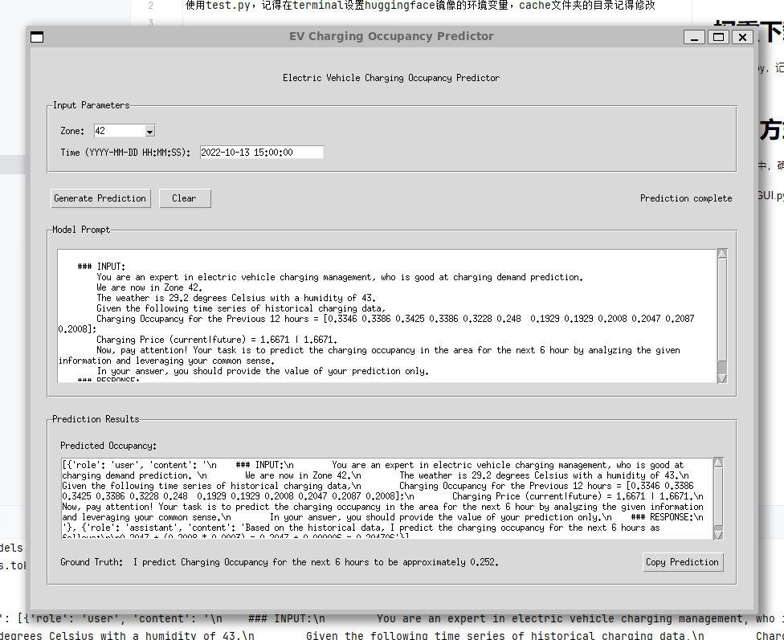

# 权重下载方法
使用test.py，记得在terminal设置huggingface镜像的环境变量，cache文件夹的目录记得修改

# 使用方式
在utils.py中，确保load_llm函数中的cache文件夹地址正确

然后运行GUI.py即可

# 修改内容
## 时间表示方式更改
原先的代码中，用户需要输入时间戳来表示时间，时间戳在存储的csv文件中代表某个具体的时间，但是用户在使用时并不明确知道文件中的时间的起止时间，因此我们将其修改为输入具体时间，再转换为时间戳进行处理
## GUI
为程序设计了用户友好的图形界面
## finetune 模型
对llama模型进行了微调